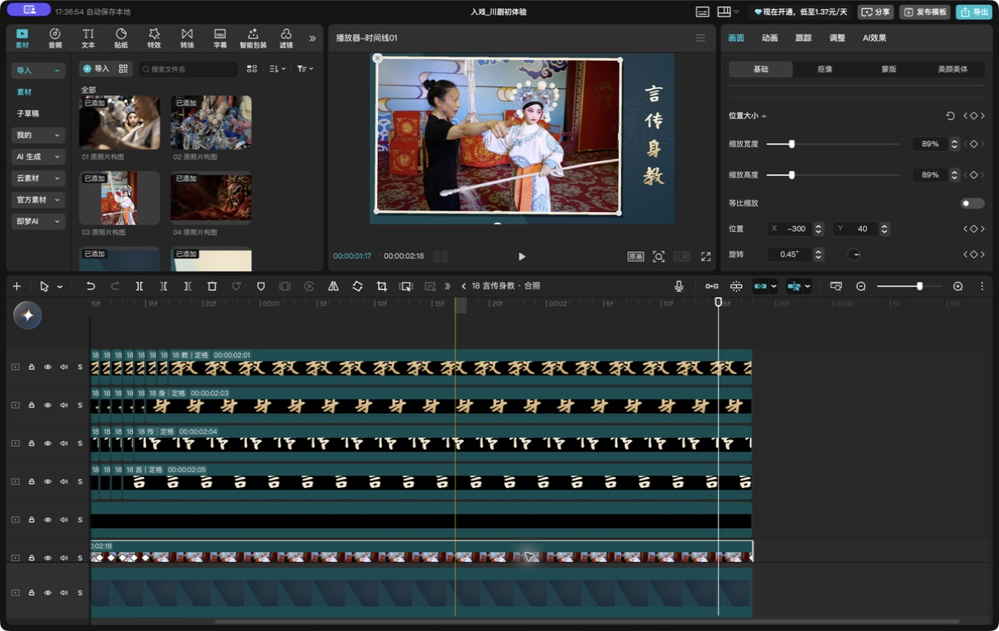
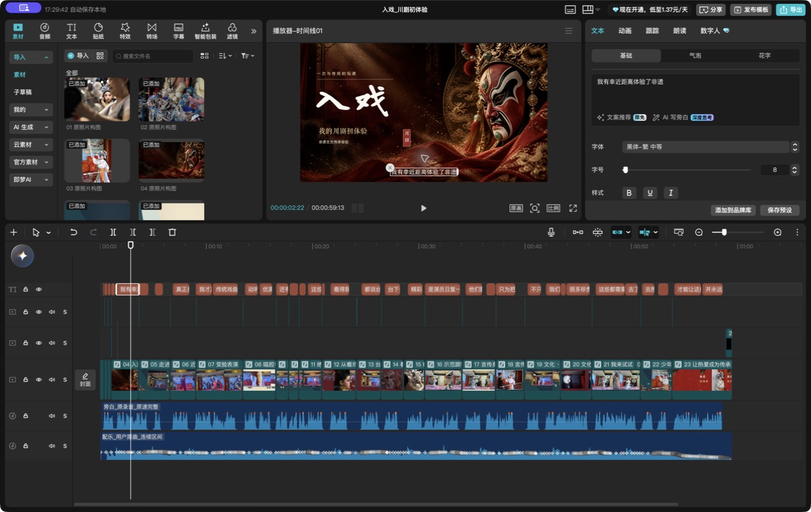
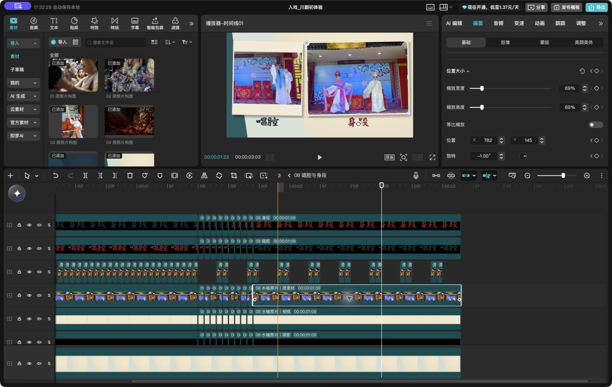

# AI 用剪映自动剪片

**Jianying Local MCP** 是一个用于 Mac 剪映的本地 MCP 工具，支持镜头编排、字幕、关键帧动画和多轨剪辑。

在支持 MCP 的 AI 客户端中提供素材和剪辑要求，AI 调用工具生成剪映草稿，再用剪映打开、预览和导出。

[快速开始](docs/quickstart.md) · [工具文档](docs/tools.md) · [案例拆解](docs/case-study.md) · [English](README.en.md)

## 作品演示

**《入戏·川剧初体验》**，一支国风短片，内容包括川剧表演、变脸、吐火、换装和体验。

https://github.com/user-attachments/assets/8ad915ff-f449-415f-b163-cdf41901cca6

[下载预览视频](docs/assets/showcase-preview.mp4) · 59.52 秒 · 1080p · 25 fps（网页预览为 720p）

这次用到了照片运镜、双画面、书法排版、旁白字幕和配乐。我觉得成片大致有认真练习一年剪辑的水平。

案例从原始视频和照片重建，共 23 个场景。缓动、场景复合和精修使用了额外脚本，未全部集成到通用 MCP。[查看制作过程](docs/case-study.md)。

## 功能

### 关键帧动画

支持位置、缩放、旋转和透明度关键帧，内置 9 种线性运动预设，可制作推近、拉远、平移、滑入和渐显。

例如，给照片设置两个缩放关键帧：起点为 100%，3 秒后为 108%，就能得到一个缓慢推近的镜头。再配合位置和旋转变化，可以制作照片滑入、倾斜等效果。



*剪映截图：“言传身教”场景的照片关键帧。*

### 字幕编辑

支持 SRT 导入、导出，以及字幕内容、时间、字号、颜色、描边和位置的修改。样式可按单条字幕或整条轨道批量设置。

案例中的 28 句旁白排成 36 个原生文字片段，可以在剪映里直接改字。书法标题使用独立 PNG，支持移动、缩放和替换图片。



*剪映截图：选中旁白字幕后，右侧显示文字与样式设置。*

### 多轨剪辑

支持片段追加、拆分、排序、裁切，以及删除时间区间后收拢后续内容。视频、图片、文字和音频可按轨道组织。

案例主时间线整理为 6 条轨道，23 个场景分别封装为复合片段。照片、纸边、阴影和书法保留独立图层；场景复合由案例脚本完成。



*剪映截图：“唱腔与身段”场景的双画面及内部图层。*

### 批量编辑

`batch_edit` 可在一次调用中完成多项修改。例如：修改字幕、加粗、统一字号、添加描边、设置渐显，全部完成后保存一个新版本，保留原项目，不生成中间工程。

0.3.0 同时增加了简要返回和素材信息缓存，减少重复调用、素材探测与文件复制。[性能测试与使用示例](docs/performance.md)。

## 快速开始

需要 macOS、Python 3.11+，以及本机安装的剪映。

```sh
git clone https://github.com/Capricornus-joe/jianying-local-mcp.git
cd jianying-local-mcp
bash setup.sh
bash run.sh doctor
```

按 [安装与配置](docs/quickstart.md)连接 MCP 客户端，创建第一个草稿。文档提供了纯文字示例和批量编辑示例，无需下载测试素材。

## 兼容性

当前版本提供 22 个工具，通过本地 stdio 运行。Mac 草稿兼容性仍在测试中，生成后需要在剪映内检查和导出。

- 仅修改本工具管理的计划，每次保存为新版本。
- 剪映中的手动修改不会自动同步回 MCP。
- 不支持解密草稿、直接改写任意已有工程或可靠的 Mac 原生自动导出。
- 部分原生效果依赖本机缓存和剪映版本。

详细支持范围见 [兼容性说明](docs/compatibility.md)。

## 文档与贡献

[工具参考](docs/tools.md) · [排错指南](docs/troubleshooting.md) · [草稿结构](docs/native-schema.md) · [贡献指南](CONTRIBUTING.md) · [更新记录](CHANGELOG.md)

问题反馈请提交 [Issue](https://github.com/Capricornus-joe/jianying-local-mcp/issues)，附上版本、操作步骤和脱敏错误信息。复现素材请使用合成文件。

## 许可证

代码采用 [MIT](LICENSE)，依赖与参考项目见 [第三方说明](THIRD_PARTY_NOTICES.md)。案例视频和截图仅供项目展示，详见 [媒体授权](docs/case-study.md#媒体授权)。本项目与剪映、CapCut、字节跳动无隶属关系。
